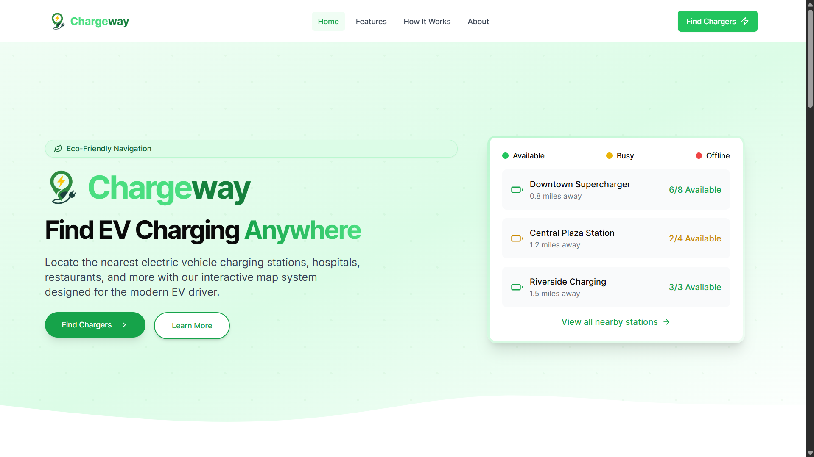
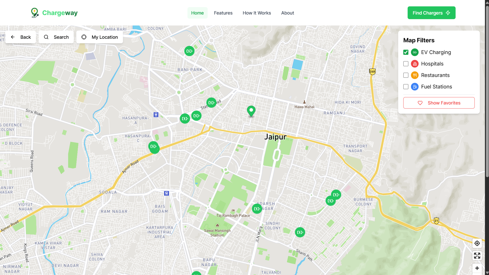
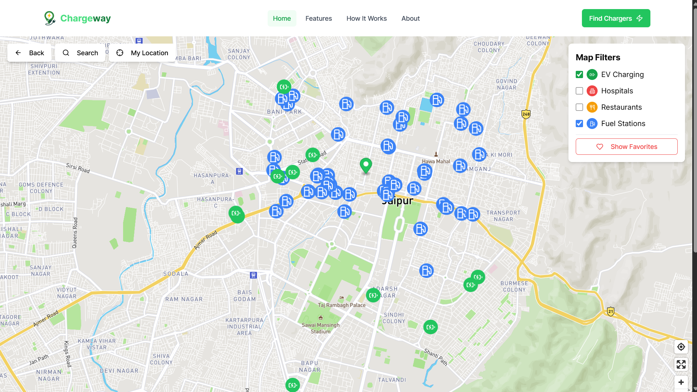

# Chargeway 

Chargeway is a web application designed to help users find electric vehicle (EV) charging stations across India. Whether you're planning a trip or just looking for the nearest charging point, Chargeway ensures you're always powered up. It features a sleek UI, intuitive search functionalities, and real-time data from reliable APIs.

## 👥 Project Authors

Built with ❤️ by:

- [Arya Sharma](https://github.com/iaryasharma)
- [Vijay Kumar](https://github.com/hii-vijayy)  

## Features

- ⚡ Find nearby EV charging stations
- 🌿 Interactive and eco-themed homepage
- 🛣️ Route-based charging station search
- 🌐 Responsive, modern UI with green aesthetics
- 🔍 Location autocomplete for better UX

## Tech Stack

- **Frontend:** Next.js, Tailwind CSS, Mapbox GL JS
- **APIs:**
  - Open Charge Map API
  - TomTom Search API
  - Mapbox Maps API
- **Deployment:** Vercel

## Getting Started

### Prerequisites

Make sure you have the following installed:

- Node.js >= 16
- npm or yarn

### Installation

1. **Clone the repository**

```bash
git clone https://github.com/iaryasharma/chargeway.git
cd chargeway
```

2. **Install dependencies**

```bash
npm install
# or
yarn
```

3. **Set up environment variables**

Create a `.env.local` file in the root directory and add the following:

```
NEXT_PUBLIC_MAPBOX_TOKEN=your_mapbox_token
NEXT_PUBLIC_OPEN_CHARGE_MAP_API_KEY=your_open_charge_map_api_key
NEXT_PUBLIC_TOMTOM_API_KEY=your_tomtom_api_key
```

### Run the development server

```bash
npm run dev
# or
yarn dev
```

Open [http://localhost:3000](http://localhost:3000) with your browser to see the app.


## APIs Used

- **Open Charge Map** - Provides global data on EV charging stations
- **TomTom Search API** - Used for location search and autocomplete
- **Mapbox GL JS** - For interactive maps and marker rendering

## Screenshots

### 🏠 Homepage


### 📍 Nearby Stations


### 🗺️ Map View with Markers


## Future Improvements

- Route optimization for long trips
- Charging station availability in real-time
- User login and saved favorite stations
- Filters by charging type and power rating

## Contributing

Contributions are welcome! Please open an issue or submit a pull request for any improvements or bug fixes.

## License

[MIT](LICENSE)
